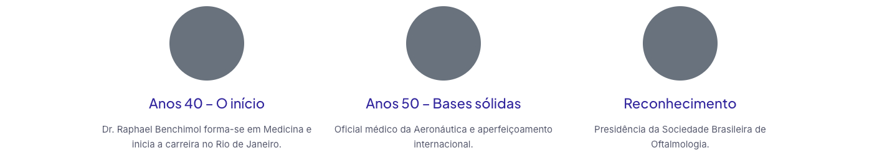
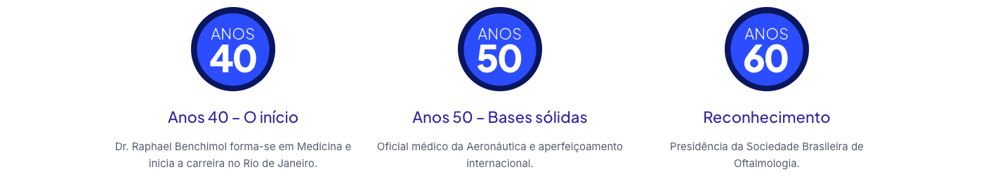

# Ícones da trajetória em Sobre Nós — 02/10/2026

Gabriel enviou um print da seção “Nossa trajetória ao longo das décadas”, na página `/sobre-nos/`, mostrando círculos cinza vazios. O objetivo é preservar os ícones originais com as décadas, cores e formas existentes.

## Causa e referência

A página WP2843 possui nove SVGs, com 18 círculos e 60 paths. A geometria permanece no HTML sanitizado. Entretanto, as cores são definidas por `<defs><style>` em `contentHtml`; `renderedHtml` e a sanitização pública removem esse elemento. Todos os shapes herdavam `rgb(105, 114, 125)` do widget Elementor, escondendo os números/letras.

As nove definições originais são idênticas: `.cls-1{fill:#0a165e;}.cls-2{fill:#2b4dff;}.cls-3{fill:#fff;}`. Também estão nos arquivos SVG públicos preservados, por exemplo `public/wp-content/uploads/2025/08/anos40-1.svg`. [Página original](https://clinicadeolhosbenchimol.com.br/sobre-nos/).

## Correção

`src/components/public/public.css` acrescenta somente três regras de fill para `.cls-1/2/3`, sob `.public-site .elementor-2843 .elementor-icon-box-icon .elementor-icon svg`. O seletor cobre os nove ícones atuais e não alcança outros SVGs, cabeçalho, rodapé ou WhatsApp. Os círculos azul escuro/azul e a tipografia branca voltam a ter as cores originais.

Não houve alteração de sanitizer, classes/IDs, atributos, geometria, textos, ordem, captura, manifests, arquivos SVG ou conteúdo do banco. Não permitir CSS do HTML nem remover proteções para restaurar esses ícones. Se forem substituídos futuramente por SVGs com as mesmas classes e outra paleta, revisar/remover essas regras na mesma alteração aprovada.

## Evidências no navegador

Fixture offline: HTML real de `pageTemplate()`/`renderCapturedHtml()`, stylesheet capturado selecionado por `publicStylesheet()` e `public.css`, em Chrome headless isolado. Somente fontes/imagens locais disponíveis; recursos externos bloqueados. Nenhum servidor Next, Docker ou Supabase necessário.

- [Antes](before.json): reprodução em 1440px falhou como esperado. Os nove SVGs herdavam cinza em todos os círculos/paths.
- [Depois](after.json): seis combinações aprovadas — 393/768/1440px, nas duas ordens de CSS. Cada uma conferiu os nove SVGs, 18 círculos, 60 paths, azul escuro `rgb(10, 22, 94)`, azul `rgb(43, 77, 255)` e branco `rgb(255, 255, 255)` em todos os respectivos shapes.
- Controles com classes `.cls-1/2/3` fora da página e fora dos icon-boxes mantiveram a cor própria `rgb(1, 2, 3)`. Não houve vazamento da paleta, overflow horizontal ou markup executável no conteúdo renderizado.
- Revisão independente do diff confirmou escopo, fidelidade e sanitização preservados, sem achados.

| Antes, primeira linha | Depois, primeira linha |
|---|---|
|  |  |

Os screenshots mostram os três primeiros ícones; os nove foram medidos em cada caso dos JSON. Os registros vinculam a evidência aos hashes do HTML e CSS utilizados. Não foi teste em Safari/iPhone físico nem verificação do patch publicado.

## Checks e entrega

Os [checks finais](checks.json) registram 301/301 testes em 51 arquivos, zero falhas, exit0 ([relatório completo](tests.json)). TypeScript passou com `node node_modules/typescript/bin/tsc --noEmit`, exit0. `npm run build` passou, build `8-5WPtV3Kf2B7rWiH6ugl`; as três regras constam do chunk CSS compilado e o stylesheet capturado manteve seu hash após a geração. `git diff --check`, exit0. Alterações anteriores de envs permanecem fora deste patch. Publicação continua sob a regra permanente de `AGENTS.md`; nenhum push, merge ou deploy foi executado nesta correção.

Após publicar, conferir `/sobre-nos/` em 393/768/1440px: nove ícones, números 40/50/60/70/80/90/2000/2010/2020 legíveis, cores/medidas/títulos originais e demais SVGs intactos. Rollback local: remover somente as três regras de fill, sem substituir captura ou reimportar conteúdo.
